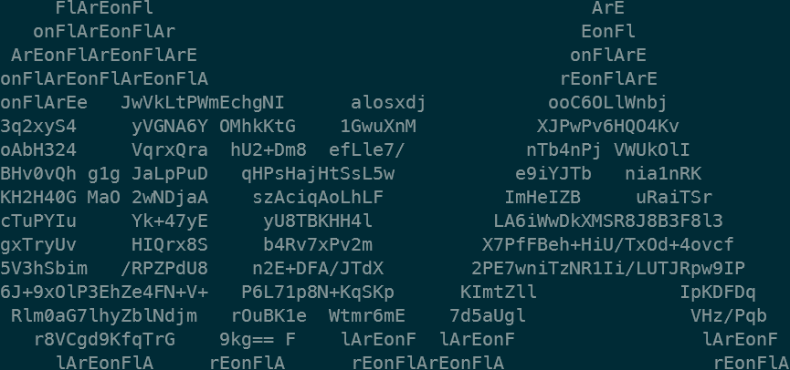

## 1. Warmup

Few days before the start of the event, [@m_r_tz](https://twitter.com/m_r_tz/status/1705204684393222654) twitted the following picture



from which we can extract the following base64

```
eJwVkLtPWmEchgNIalosxdjooC6OLlWnbj3q2xyS4yVGNA6YOMhkKtG1GwuXnMXJPwPv6HQO4KvoAbH324VqrxQrahU2+Dm8efLle7/nTb4nPjVWUkOlIBHv0vQhg1gJaLpPuDqHPsHajHtSsL5we9iYJTbnia1nRKKH2H40GMaO2wNDjaAszAciqAoLhLFImHeIZBuRaiTSrcTuPYIuYk+47yEyU8TBKHH4lLA6iWwDkXMSR8J8B3F8l3gxTryUvHIQrx8Sb4Rv7xPv2mX7PfFBeh+HiU/TxOd+4ovcf5V3hSbim/RPZPdU8n2E+DFA/JTdX2PE7wniTzNR1Ii/LUTJRpw9IP6J+9xOlP3EhZe4FN+V+P6L71p8N+KqSKpKImtZllIpKDFDqRlm0aG7lhyZblNdjmrOuBK1eWtmr6mE7d5aUglVHz/Pqbr8VCgd9KfqTrG9kg==
```

this is a zlib compress shellcode that does:

```python
>>> from pwn import xor
>>>
>>> k = b'#flareon10'
>>> s = b's\x07\x18\x08\x17\x0b\x0c\x0b\x11YPF\x1e\x04\x05\x04\x1d\nTT\x03\x15\x03\x0e\x1c\x00\x1dN^B\x03\n\r\x15\x17\x17OC\x11RV\x12L\x14\x01\x10\x0e\x02]I\x03\n\r\x15\x17\x17A'
>>> print(xor(k, s))
b'Patience is rewarded sooner or later - but usually later.'
```


Alternatively it's an easy unicorn target (yes, i am in a [unicorn](https://www.unicorn-engine.org/) mood lately): [emu.py][emu.py]
