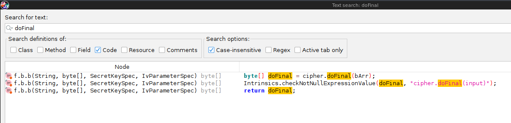

## 1. Read code

use jadx-gui and read code.

Looked for the crypto and walked my way up the xrefs. The firebase stuff was safely ignored :)




## 2. Extract data

```
% java -jar apktool_2.8.1.jar d -o out -f ItsOnFire.apk
```

## 3. Decrypt

after reading code and extracting data you should be able to [decrypt](slv.py) it ezpz.


