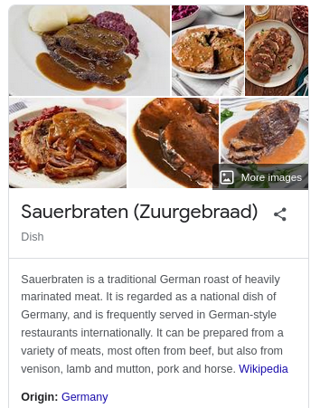

## 1. Sauerbraten

This is an aimbot (and info stealer) for a game called sauerbraten.

My initial google search returned

So i assumed this was just a made up thing by the german FLARE team, and did most of it without the actual game, up until the last stage where i was kind of stuck. I refined my search and found
[this](http://sauerbraten.org/) FPS game.

Meanwhile i had to hunt for config files of softwares i dont own, sometimes even install them and bloat my VM. I love snapshots...

## 2. Matrioshka

Basically each shellcode will look for a specific software (steam, discord, etc...) config or file of interest, stash them somewhere safe for exfil and use part of the said files to decrypt the next stage shellcode.
Each shellcode uses the same structure, so once you've reversed one, you've basically reversed them all.

## 3. Morality

Practice your google search and don't assume you're getting trolled 24/7 by german gentlemen :) (even though you are).
