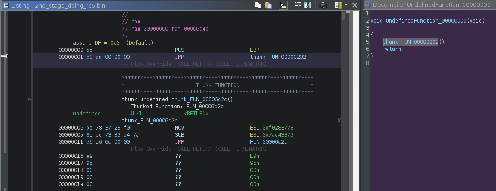
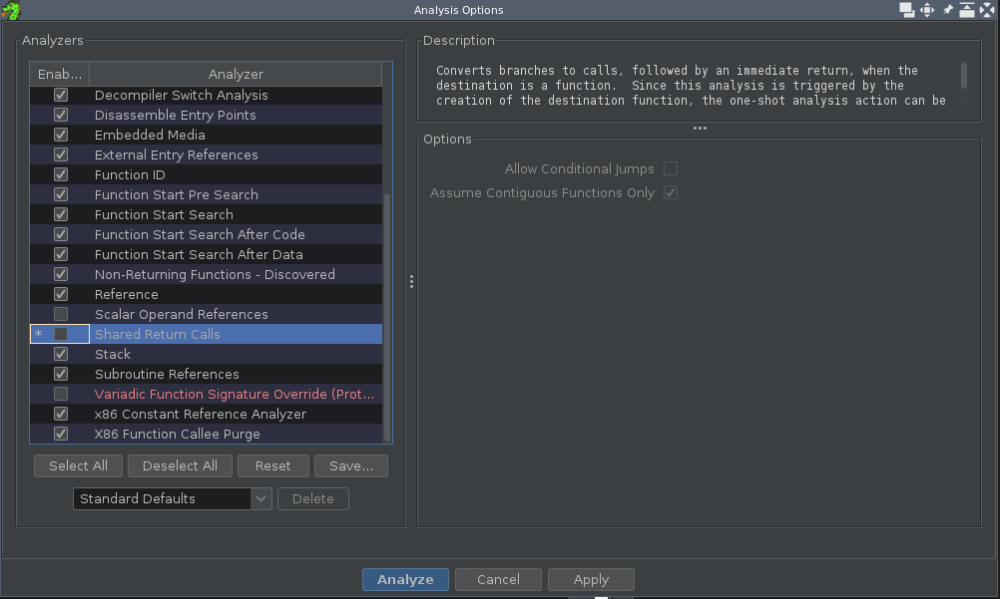
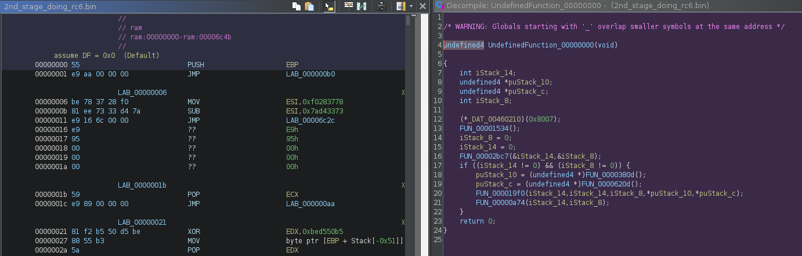
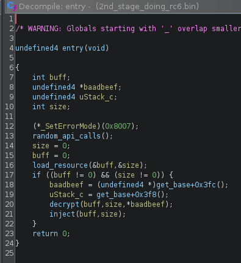

It's flare-on, you made it this far, you know how to dump shellcodes to disk and analyze them: there's no need to cover.

But you end up with a code full of jumps, your tool creates functions everywhere, you can't make sense of anything and it drives you crazy.

## 1. It's 2023 - who needs a deobfuscator for JUMPS ?



Use the cheap (free) [dragon](https://ghidra-sre.org/) tool and load your shellcode.

When asked for analysis, don't get too excited and take the time to uncheck `Shared Return Calls`:



You can then enjoy readable pseudocode:



You can then press the `auto-reverse hotkey` to have everyting nicely renamed:



## 2. Find the RC6

Assuming you found the one shellcode that does RC6, follow the `decrypt`  function, to 

```python
void decrypt(undefined4 buff,undefined4 siuze,uint key)

{
    undefined4 heap;
    undefined4 *key_out;
    
    heap = (*_GetProcessHeap)(8,0x90);
    key_out = (undefined4 *)(*_RtlAllocateHeap)(heap);
    if (key_out != NULL) {
        key_setup(key,key_out);
        rc6_block(buff,siuze,key_out);
        heap = (*_GetProcessHeap)(8,key_out);
        (*_DAT_00460218)(heap);
    }
    return;
}
```

in the `key_setup`, you can find the magic constants and say yayy for RC6:

```python
void key_setup(uint key,undefined4 *key_out)

{
    undefined4 uVar1;
    int local_30;
    int local_2c;
    uint local_20;
    uint local_1c;
    
                    /* 0xbaadbeef -> 0xef0001ba */
    key = key >> 0x18 | key >> 8 & 0x10 | (key & 1) << 8 | key << 0x18;
    *key_out = 0xb7e15163;
    local_1c = 1;
    while( true ) {
        if (0x23 < local_1c) break;
        key_out[local_1c] = key_out[local_1c - 1] + -0x61c88647;
        local_1c = local_1c + 1;
    }
    local_20 = 0;
    local_2c = 0;
    local_1c = 0;
    local_30 = 1;
    while( true ) {
        if (0x6c < local_30) break;
        uVar1 = FUN_000064e7(3);
        uVar1 = FUN_00002b3e(key_out[local_1c] + local_2c + local_20,uVar1);
        key_out[local_1c] = uVar1;
        local_2c = key_out[local_1c];
        uVar1 = FUN_000064e7(local_2c + local_20);
        key = FUN_00002b3e(key + local_2c + local_20,uVar1);
        local_1c = (local_1c + 1) % 0x24;
        local_30 = local_30 + 1;
        local_20 = key;
    }
    return;
}
``` 


there's also a slight modification of the key which transforms `BAADBEEF` to `EF0001BA`:
```python
key = key >> 0x18 | key >> 8 & 0x10 | (key & 1) << 8 | key << 0x18;
``` 


The RC6 uses `0x10` rounds as evidences suggest in there:

```python
void rc6_block(int param_1,uint param_2,int *param_3)

{
    int iVar1;
    uint uVar2;
    undefined4 uVar3;
    uint uVar4;
    uint *puVar5;
    int round;
    uint local_c;
    
    local_c = 0;
    while( true ) {
        if (param_2 <= local_c) break;
        puVar5 = (uint *)(param_1 + local_c);
        puVar5[1] = puVar5[1] + *param_3;
        puVar5[3] = puVar5[3] + param_3[1];
        round = 1;
        while( true ) {
                    /* 0x10 rounds */
            if (0x10 < round) break;
            uVar3 = FUN_000064e7(5);
            uVar4 = FUN_00002b3e((puVar5[1] * 2 + 1) * puVar5[1],uVar3);
            uVar3 = FUN_000064e7(5,uVar4);
            uVar2 = FUN_00002b3e((puVar5[3] * 2 + 1) * puVar5[3],uVar3);
            uVar3 = FUN_000064e7(uVar2);
            iVar1 = FUN_00002b3e(*puVar5 ^ uVar4,uVar3);
            *puVar5 = iVar1 + param_3[round * 2];
            uVar3 = FUN_000064e7(uVar4);
            iVar1 = FUN_00002b3e(puVar5[2] ^ uVar2,uVar3);
            puVar5[2] = iVar1 + param_3[round * 2 + 1];
            uVar2 = *puVar5;
            *puVar5 = puVar5[1];
            puVar5[1] = puVar5[2];
            puVar5[2] = puVar5[3];
            puVar5[3] = uVar2;
            round = round + 1;
        }
        *puVar5 = *puVar5 + param_3[0x22];
        puVar5[2] = puVar5[2] + param_3[0x23];
        local_c = local_c + 0x10;
    }
    return;
}
``` 

## 3. Going in for the flag

Now is the time of endless wandering looking for data to decrypt.

Somewhere along the path you dumped the thing injected into explorer.exe.

In there lies a blob of high entropy data data stuck between 2 BAADBEEF markers, you find it and reuse the previously acquired key, (in my case, badly) using the awesome [Binery Refinery](https://github.com/binref/).

```
% python -c 'import sys; sys.stdout.buffer.write(open("explorer_injected2.bin", "rb").read().split(b"\xef\xbe\xad\xba")[1])' | rc6 le:e:0xef0001ba -Rr -k 0x10
``` 
