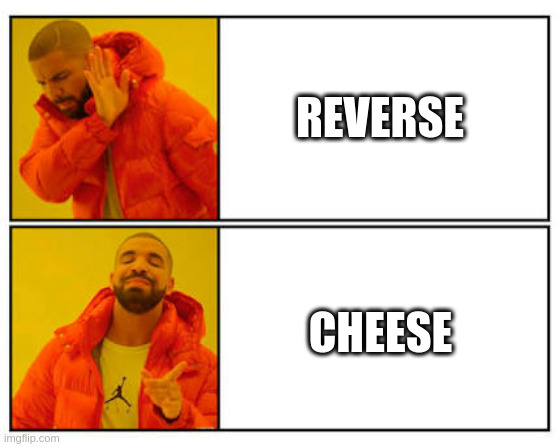

## 1. The Python Challenge

it's a snake game, it's compiled with [Nuikta](https://nuitka.net/).

## 2. Feed the snake with cheese

- Grab the [PyInjector](https://github.com/call-042PE/PyInjector) pre-built DLL
- write `print(dir())` into `code.py`
- inject with ProcessHacker into the `flake.exe`
- notice the `game_win` function
- write `game_win()` into `code.py`
- inject with ProcessHacker into the `flake.exe`
- shameless (?), low effort flag

