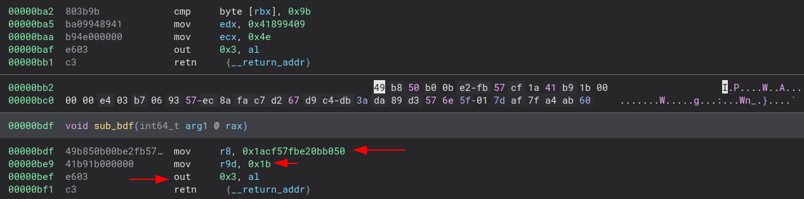
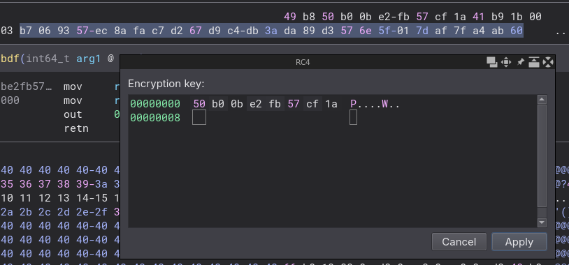
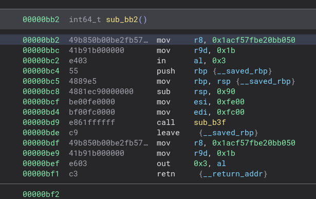

## 1. I Wanted a VM challenge and all i got was an hypervisor challenge...

...and it was cool :)

opening the binary yields some clean pseudocode (for a change) that uses the [Windows Hypervisor Platform API](https://learn.microsoft.com/en-us/virtualization/api/hypervisor-platform/hypervisor-platform).

It feeds the partition some code from the PE resource and respond to IO requests (namely IN and OUT instructions) by RC4 decrypting and encrypting code relative to plus or minus RIP offset.

## 2. Debugging

I wanted to get a grasp of the code in the rsrc because offset 0 wasn't making much x64 sense and didnt know where to start (author explains why in the official solution - it starts with 16 bits code).

I have no windows host, so filled with some sweet candid hope, I enabled HyperV in my analysis VM, rebooted and ended up... with a bricked VM... once more, yayy for snapshots.

Long story short, i have never been able to run the binary.

## 3. Static analysis

I loaded the extracted resource into Binary Ninja, found some random piece of code that made sense and walked my way out.



Gosso modo, the `OUT` instruction means we can RC4 `decrypt` `R9` (0x1b) bytes above the current position using the `R8` as key (0x1acf57fbe20bb050).

It actually tells the hypervirsor to reencrypt the executed code block, but that's too much details heee.

Binary Ninja let you do RC4 from the tip of your mouse:






Rinse and repeat, all it took was some clicky clicky during session a 20mins train ride from work to home while chatting with a friend, not the end of the world...


## 4. Going for the flag

Using advanced reverse engineering skills, we can find the entry point of the VM: the function with no XREF at offset `0xbb2`, which quickly leads to:

```python
undefined8 check_and_final_ret(byte *flare2023,undefined8 param_2)

{
    int res_func1;
    undefined8 res_func2;
    
    res_func1 = check_param1(flare2023);
    res_func2 = check_param2(flare2023,param_2);
    if ((res_func1 == 0x24) && ((int)res_func2 == 1)) {
        res_func2 = 0x1337;
    }
    else {
        res_func2 = 0;
    }
    return res_func2;
}
```

The inputs consists for 2 parts, the first part is gifted to us:

```python
int check_param1(byte *param_1)

{
    local_48 = 0x41405b283733232a;
    local_40 = 0x595f20202e202b46;
    local_38 = 0x57373d2d21334042;
    local_30 = 0x2a3e2c3935435b5d;
    local_28 = 0x6d7573705a5f5540;
    local_20 = 0x7370696d65726f6c;
    local_18 = 0;
    local_88 = 0x7370696d65726f6c;
    local_80 = 0x696d65726f6c6d75;
    local_78 = 0x65726f6c6d757370;
    local_70 = 0x6f6c6d757370696d;
    local_68 = 0x6d757370696d6572;
    local_60 = 0x7370696d65726f6c;
    local_58 = 0;
    len = strlen(param_1);
    match = 0;
    for (i = 0; i < len; i = i + 1) {
        if ((param_1[i] ^ *(byte *)((longlong)&local_88 + (longlong)i)) == *(byte *)((longlong)&local_48 + (longlong)i)) {
            match = match + 1;
        }
    }
    return match;
}
``` 


just xor those 2 stack arrays and feel the power flow through your body:

```
% cat | stack.py
    local_48 = 0x41405b283733232a;
    local_40 = 0x595f20202e202b46;
    local_38 = 0x57373d2d21334042;
    local_30 = 0x2a3e2c3935435b5d;
    local_28 = 0x6d7573705a5f5540;
    local_20 = 0x7370696d65726f6c;
size: 64
b'*#37([@AF+ .  _YB@3!-=7W][C59,>*@U_Zpsumloremips'

% cat | stack.py
    local_88 = 0x7370696d65726f6c;
    local_80 = 0x696d65726f6c6d75;
    local_78 = 0x65726f6c6d757370;
    local_70 = 0x6f6c6d757370696d;
    local_68 = 0x6d757370696d6572;
    local_60 = 0x7370696d65726f6c;
size: 64
b'loremipsumloremipsumloremipsumloremipsumloremips'

% python
>>> from pwn import xor
>>> xor(b'*#37([@AF+ .  _YB@3!-=7W][C59,>*@U_Zpsumloremips', b'loremipsumloremipsumloremipsumloremipsumloremips')
b'FLARE2023FLARE2023FLARE2023FLARE2023\x00\x00\x00\x00\x00\x00\x00\x00\x00\x00\x00\x00'
```


The 2nd part actually requires doing some reversing, but i'm too much of an idiot for that.

It first take the first input and generates some data, then performs a serie of xors.

I've asked my [unicorn](test_array.py) friend to generate that data for me and then my second friend [z3](slv.py) to solve it for me.

When you have no brain, you have good friends :)
